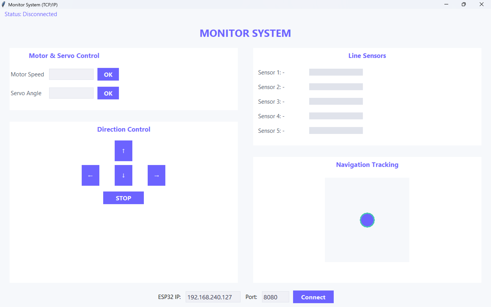

# Monitoring & Control GUI Robot Wireless

Proyek ini merupakan tugas dari mata kuliah RE-202 Pemrograman Berorientasi Objek (OOP) yang bertujuan membangun sistem monitoring dan kontrol robot secara wireless melalui GUI Python (Tkinter) yang terhubung ke ESP32 melalui jaringan WiFi.

## Fitur Utama

Hardware:

- ESP32 Dev Board.

- Motor DC (2).

- Motor Driver (L298N).

- Line Sensor BFD 5 Channel.

- Micro Servo Mg90-s.

- Power Supply.

Software:

- Python 3.x + Tkinter + socket + threading.

- Arduino IDE + Library WiFiManager ESP32.

- ESP32 sebagai server TCP/IP.

## Cara Kerja

- ESP32 membuka mode AP + portal konfigurasi (WiFiManager)

- ESP32 menerima perintah dari GUI (misal: M:120,130) untuk atur kecepatan motor, dan begitu juga untuk mengatur sudut derajat pada servo.

- ESP32 membaca line sensor, lalu mengirim statusnya ke GUI.

- GUI Python menampilkan slider motor, tombol arah, dan visualisasi sensor garis.

## GUI

  

## Tim Pengembang

- Ichsan Fajar Yudika (4222401042)
- Wildan Mahfudh Khoirul Murtadho (4222401046)
- M. Rasyid Prasetyo (4222411048)
- Moh. Abdul Hikmal (4222401032)
