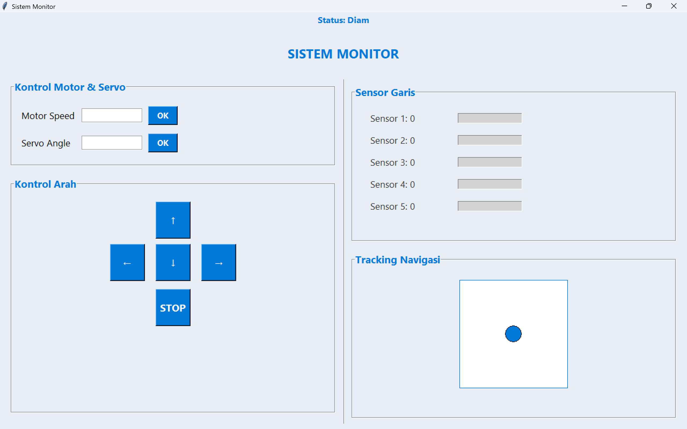

## 📡 Monitoring & Control GUI Robot

Proyek ini merupakan tugas dari mata kuliah RE-202 Pemrograman Berorientasi Objek (OOP) dengan tujuan membangun sistem monitoring dan kontrol robot berbasis GUI menggunakan Python (Tkinter) yang terhubung dengan mikrokontroler (Arduino). GUI ini dapat mengontrol kecepatan motor, sudut servo, arah gerak robot, serta memonitor status 5 sensor garis secara real-time.

### 🛠️ Fitur Utama

- Kontrol kecepatan motor dan sudut servo melalui GUI

- Kendali arah robot (Maju, Mundur, Kiri, Kanan, Stop)

- Monitoring status 5 sensor garis secara real-time dengan indikator progress bar

- Visualisasi tracking navigasi robot dalam bentuk animasi

- Komunikasi dua arah antara Python dan Arduino via Serial (USB)

## ⚙️ Komponen yang Digunakan

### Hardware

- Arduino Uno / Nano

- Motor DC (2x)

- Driver Motor (L298N atau setara)

- Servo SG90

- Sensor garis (5 channel)

- Kabel jumper & Breadboard

- Power supply eksternal

### Software:

- Python 3.x

- Tkinter (GUI bawaan Python)

- PySerial (pip install pyserial)

- Arduino IDE

## 🪟 Tampilan GUI

  

## 🧑‍💻 Tim Pengembang

- Ichsan Fajar Yudika (4222401042)
- Wildan Mahfudh Khoirul Murtadho (4222401046)
- M. Rasyid Prasetyo (4222411048)
- Moh. Abdul Hikmal (4222401032)

